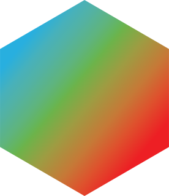

<div align="center">
  
  <h1 align="center">Blendkit for Godot</h3>

  A simple yet effective add-on that lets you import models
  from the [Blendkit](https://blendkit.com) library
  to [Godot Engine](https://godotengine.org/).

  [](https://github.com/BlenderKit/bk_godot/releases/latest)
  [](LICENSE)
</div>

# About

Browse the [Blendkit.com](https://blendkit.com) gallery, click **Send to Godot**
on any asset, and let it land directly in your Godot
project - organized and ready to use.

You can process assets as you see fit, possibly building your own workflow /
pipeline on top of this simple mechanism.

See [User Guide](https://blendkit.com/godot) for an overview,
screenshots, and getting started guide.

This project is Free and Open Source Software under GPLv2.

[Contributions](#contributing) are highly encouraged and welcome 🤝

⭐ Star this repo to show support and interest in continued development, thanks!


## Status

### alpha

Blendkit Godot plugin is in **active early development** focusing on polishing
fundamentals (building, testing, integration) in order to provide a robust
user and developer experience, including distribution and installation.

As of now, please consider this software **experimental** 🧪

It's a great time to test and [contribute](#contributing) so that the
plugin is useful for you and everyone else.

**IMPORTANT:** Godot Blender imports are relatively young and many `.blend` files can
import incorrectly or not import at all with ample amount of warnings and errors
printed to Godot Output. As of Godot 4.5.1, Blender 3 is required while Blender
5 has been out for some time.

This plugin will get increasingly useful as native Blender -> Godot import
improves.

Experimental **GLTF** support was introduced in `0.4.0` - there is now an option
to prefer GLTF (`*.glb`, `*.gltf`) over original Blender (`*.blend`) file. GLTF
auto-exports are by no means perfect, but they might occassionally work.


## Requirements

Blendkit Godot Plugin requires:

- Godot Engine: **4.X**
- OS: **Linux**, **Windows**
    - **MacOS** doesn't work yet due to security (work in progress)
- Architectures: **x86_64**, **arm64**
- Web browser: **permission to access local network** (to connect to Blendkit Client)


## Installation

See [User Guide](https://blendkit.com/godot) for a visual overview
of installation and usage.

The Plugin needs to be installed for each Godot project.

### From the Godot Asset Store (recommended)

In **Godot 4.7** and newer, use the built-in **Asset Store** tab:

1. Search for **Blendkit**, click the plugin and press **Download**.
2. Go to **Project → Project Settings... → Plugins** tab.
3. Check **Enabled** for **Blendkit**.

You can also browse the plugin on the
[Godot Asset Store](https://store.godotengine.org/asset/blendkit/blendkit/) website.

### From a ZIP archive

Download the `blendkit-godot_vX.Y.Z.zip` archive from the
[Godot Asset Store](https://store.godotengine.org/asset/blendkit/blendkit/)
or [GitHub Releases](https://github.com/BlenderKit/bk_godot/releases)
(or [build](#building) your own from sources), then:

1. **Extract** the ZIP into your Godot project root directory (where `project.godot` is located)
    - **DO NOT** copy `addons/` or `addons/blendkit/` from this repo without
    [building](#building) Client binaries first.
2. Open your project in **Godot Editor**, go to **Project → Project Settings... → Plugins** tab
3. Check **Enabled** for **Blendkit**

If installation succeeded, you should see a new **Blendkit** tab in the right
panel dock (next to **Inspector**) as well as `Blendkit:` messages in editor
Output.

### Upgrading

Always do a **clean install** when upgrading to a new version:

1. Delete the `addons/blendkit/` directory from your Godot project.
2. Install the new version as usual (see above).

This avoids stale files left over from the previous version.


## Usage

After Blendkit Godot plugin is installed and enabled in your Godot project,
you should see a new **Blendkit** tab in the right panel dock (next to
**Inspector**) of the Godot Editor.

You can now browse assets from [Blendkit.com](https://blendkit.com) in your
browser and download them into your Godot project with a single click on the **Send
to Godot** button on any **Get asset** page.

For example, after downloading two models and one material:

```
bk_assets
├── materials
│   └── stylized-wooden-_42daf872-0c07-4f9f-bd51-2d741043096b
│       └── stylized-wooden-floor_2K_724059e9-51b8-4d19-8088-3a11745347a2.blend
└── models
    ├── 19th-century-pap_6c28bfad-6678-4e85-abbc-41b36c436c96
    │   └── 19th-century-paper-clutter-waste_2K_2e96ac1b-aae0-4c49-b352-6553f693f841.blend
    └── wooden-lamp_84286bab-7077-4bb8-a83f-f035c71e9885
        └── wooden-lamp_e6458d96-fe9f-4b4d-a164-c7d61974be86.blend
```

You don't need a credit card to get free assets, but you can access paid assets
should you decide to support artists with a
[Blendkit.com](https://blendkit.com) Full Plan.

You can create empty `.gdignore` file in `bk_assets/` to prevent Godot
auto-import.


## Architecture

```text
     local machine                                          internet

┌──────────────────────┐
│    Blendkit Godot    │
│      (GDScript)      │
└──────────────────────┘
           ▲
           │
     HTTP  │  connects to existing Blendkit Client
           │  or spawns a new one
           │
           ▼
┌──────────────────────┐            HTTPS             ┌────────────────────┐
│   Blendkit Client    │◄────────────────────────────►│    blendkit.com    │
│        (Go)          │     search/download/auth     │       server       |
└──────────────────────┘                              └────────────────────┘
           ▲
           │
     HTTP  │  initiate download
           │
           ▼
┌─────────────────────────┐
│   Browser / bkclientjs  │
│       (JavaScript)      │
└─────────────────────────┘
```

### Weak points

- **Browser ↔ Client** connection may be blocked by browser policy / firewall / OS settings
- **Godot ↔ Client** connection may be lost if Godot doesn't send heartbeat for
  too long, this leads to Client auto (re)start


## Directory Structure

- `addons/blendkit/` - Godot plugin sources (standard Godot addon path)
- `BlenderKit/` - Blendkit Client sources (cloned from upstream repo)
- `tests/` - pytest test suite
- `out/` - Build output directory (generated)
- `project.godot` - Godot project file for development and testing


## Building

You need the following requirements:

- **Python 3** for running the `dev.py` build script

Clone the repo and do a full build:

```sh
git clone https://github.com/BlenderKit/bk_godot.git
cd bk_godot
python dev.py build
```

By default this builds from a **published client release**:

- downloads the latest stable [Blendkit Client](https://github.com/BlenderKit/BlenderKit)
release (the signed binaries) into `client-dist/` and verifies its sha256
(`./dev.py get-client-release`)
- copies the client binaries into the plugin directory
- creates a distributable ZIP archive (`./dev.py build-archive`)

Pin a specific release with `./dev.py build --tag vX.Y.Z`.

The distributable ZIP will be at `out/blendkit-godot_vX.Y.Z.zip`.

### Building the client from source

To compile the client yourself instead of using a release (requires **Go** and
**git**):

```sh
./dev.py build --from-source
```

This clones [Blendkit Client](https://github.com/BlenderKit/BlenderKit) into
`BlenderKit/`, builds it with Go, and assembles the plugin.


## Development

This repository is set up as a Godot project, so you can open it directly in
Godot Editor for development and testing.

1. Clone this repository
2. Build (downloads the client release and assembles the plugin):
   ```sh
   ./dev.py build
   ```
3. Open the project in Godot Editor
4. Make changes to the plugin in `addons/blendkit/`
5. Test your changes directly in the editor

Run `python dev.py` for a list of all available commands.

| Command | Description |
|---------|-------------|
| `build` | Full build from a published client release: download + plugin + archive |
| `get-client-release` | Download a published client release and install its binaries |
| `get-client-src` | Clone/update Blendkit Client repository |
| `build-client` | Build only the Go client |
| `build-plugin` | Copy client binaries into plugin directory |
| `build-archive` | Create filtered ZIP archive of the plugin |
| `clean` | Remove build artifacts (`out/` and client binaries) |
| `set-version` | Set plugin version in `plugin.cfg` |
| `test` | Run pytest tests |

Run `./dev.py <command> --help` for command-specific options.


## Testing

Run the test suite with:

```sh
./dev.py test
```

Tests use pytest with fixtures for running Godot in headless editor mode.
Use `-v` for verbose output or `-k <pattern>` to filter tests.


## Releasing

Releases are automated via GitHub Actions. To create a new release:

```sh
git tag v1.0.0
git push origin v1.0.0
```

This will:
1. Update the version in `plugin.cfg` to match the tag
2. Build the plugin with the Blendkit Client
3. Create a GitHub release with the ZIP attached


## Contributing

This project is Free and Open Source Software under GPLv2.

**Contributions are highly encouraged and welcome 🤝**

If you hit a bug or you wish something worked better, simply open a GitHub
[Issue](https://github.com/BlenderKit/bk_godot/issues).

The better you describe the problem, the easier it will be to fix.
