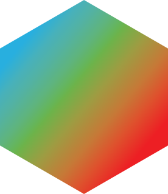

<div align="center">
  
  <h1 align="center">Blendkit for Godot</h3>

  A simple yet effective add-on that lets you import models
  from the [Blendkit](https://blendkit.com) library
  to [Godot Engine](https://godotengine.org/).

  [](https://github.com/BlenderKit/bk_godot/releases/latest)
  [](LICENSE)
</div>

# About

Browse the [Blendkit.com](https://blendkit.com) gallery, click **Send to Godot**
on any asset, and let it land directly in your Godot
project - organized and ready to use.

You can process assets as you see fit, possibly building your own workflow /
pipeline on top of this simple mechanism.

See [User Guide](https://blendkit.com/godot) for an overview,
screenshots, and getting started guide.

This project is Free and Open Source Software under GPLv2.

[Contributions](#contributing) are highly encouraged and welcome 🤝

⭐ Star this repo to show support and interest in continued development, thanks!


## Status

### alpha

Blendkit Godot plugin is in **active early development** focusing on polishing
fundamentals (building, testing, integration) in order to provide a robust
user and developer experience, including distribution and installation.

As of now, please consider this software **experimental** 🧪

It's a great time to test and [contribute](#contributing) so that the
plugin is useful for you and everyone else.

**IMPORTANT:** Godot Blender imports are relatively young and many `.blend` files can
import incorrectly or not import at all with ample amount of warnings and errors
printed to Godot Output. As of Godot 4.5.1, Blender 3 is required while Blender
5 has been out for some time.

This plugin will get increasingly useful as native Blender -> Godot import
improves.

Experimental **glTF** support was introduced in `0.4.0` - set **Model Format**
to **glTF (.glb) when available** to download glTF instead of the original
Blender (`*.blend`) file. glTF auto-exports are by no means perfect, but they
might occasionally work.


## Requirements

Blendkit Godot Plugin requires:

- Godot Engine: **4.X**
- OS: **Linux**, **Windows**
    - **MacOS** doesn't work yet due to security (work in progress)
- Architectures: **x86_64**, **arm64**
- Web browser: **permission to access local network** (to connect to Blendkit Client)


## Installation

See [User Guide](https://blendkit.com/godot) for a visual overview
of installation and usage.

The Plugin needs to be installed for each Godot project.

### From the Godot Asset Store (recommended)

In **Godot 4.7** and newer, use the built-in **Asset Store** tab:

1. Search for **Blendkit**, click the plugin and press **Download**.
2. Go to **Project → Project Settings... → Plugins** tab.
3. Check **Enabled** for **Blendkit**.

You can also browse the plugin on the
[Godot Asset Store](https://store.godotengine.org/asset/blendkit/blendkit/) website.

### From a ZIP archive

Download the `blendkit-godot_vX.Y.Z.zip` archive from the
[Godot Asset Store](https://store.godotengine.org/asset/blendkit/blendkit/)
or [GitHub Releases](https://github.com/BlenderKit/bk_godot/releases)
(or [build](#building) your own from sources), then:

1. **Extract** the ZIP into your Godot project root directory (where `project.godot` is located)
    - **DO NOT** copy `addons/` or `addons/blendkit/` from this repo without
    [building](#building) Client binaries first.
2. Open your project in **Godot Editor**, go to **Project → Project Settings... → Plugins** tab
3. Check **Enabled** for **Blendkit**

If installation succeeded, you should see a new **Blendkit** tab in the
editor's top bar (next to **Asset Store**) as well as `Blendkit:` messages in
editor Output.

### Upgrading

Always do a **clean install** when upgrading to a new version:

1. Delete the `addons/blendkit/` directory from your Godot project.
2. Install the new version as usual (see above).

This avoids stale files left over from the previous version.


## Usage

After Blendkit Godot plugin is installed and enabled in your Godot project,
you should see a new **Blendkit** tab in the top bar (next to **Asset Store**)
of the Godot Editor.

You can now browse assets from [Blendkit.com](https://blendkit.com) in your
browser and download them into your Godot project with a single click on the **Send
to Godot** button on any **Get asset** page.

For example, after downloading two models and one material:

```
bk_assets
├── materials
│   └── stylized-wooden-_42daf872-0c07-4f9f-bd51-2d741043096b
│       └── stylized-wooden-floor_2K_724059e9-51b8-4d19-8088-3a11745347a2.blend
└── models
    ├── 19th-century-pap_6c28bfad-6678-4e85-abbc-41b36c436c96
    │   └── 19th-century-paper-clutter-waste_2K_2e96ac1b-aae0-4c49-b352-6553f693f841.blend
    └── wooden-lamp_84286bab-7077-4bb8-a83f-f035c71e9885
        └── wooden-lamp_e6458d96-fe9f-4b4d-a164-c7d61974be86.blend
```

### Blendkit tab

You can also search and download assets without leaving Godot: open the
**Blendkit** tab in the editor's top bar (next to **Asset Store**).

- Search by text, sort the results, and filter by type (Models, Materials,
  HDRs, Scenes, Printables), category and **Free only**. For models, the
  **Format** dropdown is the **Model Format** setting: **glTF (.glb)** shows
  only models with glTF and downloads it, **Blender (.blend)** shows all.
- Click an asset to see its details. Choose a file and click **Download** to
  get it into `bk_assets/`, with the same layout as **Send to Godot**. The file
  defaults to the **Model Format** and **Resolution** settings. A thin bar
  along the bottom of the asset's thumbnail shows the download progress, and a
  check mark in its corner shows the asset is in the project (or an error icon
  when the download failed).
- Logging in is optional. Free assets download without an account. To
  download Full Plan assets here, click **Log In…** in the Blendkit menu at
  the end of the search bar and log in with a Full Plan account in the
  browser that opens. Without logging
  in, click **Get on blendkit.com** and use **Send to Godot** there.

The Blendkit menu at the end of the search bar (the Blendkit logo with **⋮**)
gathers the Client, the account and settings. The dot in the logo's corner
shows the Blendkit Client status: green when connected, yellow while
connecting, red when it failed and gray when it's off. The menu has:

- The Client status in full, **Enable Blendkit Client** to turn the Client on
  and off, and **Restart Client** when it failed.
- The account: your avatar, name and email once you're logged in (click them
  for your profile), and your plan (click it for the plans). **Log In…** and
  **Sign Up…** open the browser and turn the Client on if it's off, as logging
  in goes through it. **Log Out** when logged in.
- **Settings…** with the download directory (`res://bk_assets/` by default),
  **Model Format** (Blender original `.blend` by default, or glTF), **Resolution**, the Client **Port** and
  the plugin's **Log Level**.
- Links to blendkit.com, the documentation and the issue tracker.

The login is shared through the Blendkit Client, so logging in or out in
another Blendkit add-on (e.g. Blender's) does the same here while both run.
The login is stored in the editor's data directory, outside your projects.

Thumbnails are cached in `~/blenderkit_data/godot_temp/`, outside your project.

Downloads in progress, from the **Blendkit** tab and **Send to Godot** alike,
go to `bk_assets/.downloads/` first. Godot doesn't scan hidden folders and git
ignores it, so partial files are never imported or committed. Each file moves
to its folder once complete, replacing an older copy, and Godot imports it.
Downloads left there when the editor closed are deleted on the next start.

You don't need a credit card to get free assets, but you can access paid assets
should you decide to support artists with a
[Blendkit.com](https://blendkit.com) Full Plan.

You can create empty `.gdignore` file in `bk_assets/` to prevent Godot
auto-import.


## Architecture

```text
     local machine                                          internet

┌──────────────────────┐
│    Blendkit Godot    │
│      (GDScript)      │
└──────────────────────┘
           ▲
           │
     HTTP  │  connects to existing Blendkit Client
           │  or spawns a new one
           │
           ▼
┌──────────────────────┐            HTTPS             ┌────────────────────┐
│   Blendkit Client    │◄────────────────────────────►│    blendkit.com    │
│        (Go)          │     search/download/auth     │       server       |
└──────────────────────┘                              └────────────────────┘
           ▲
           │
     HTTP  │  initiate download
           │
           ▼
┌─────────────────────────┐
│   Browser / bkclientjs  │
│       (JavaScript)      │
└─────────────────────────┘
```

### Weak points

- **Browser ↔ Client** connection may be blocked by browser policy / firewall / OS settings
- **Godot ↔ Client** connection may be lost if Godot doesn't send heartbeat for
  too long, this leads to Client auto (re)start


## Directory Structure

- `addons/blendkit/` - Godot plugin sources (standard Godot addon path)
- `BlenderKit/` - Blendkit Client sources (cloned from upstream repo)
- `tests/` - pytest test suite
- `out/` - Build output directory (generated)
- `project.godot` - Godot project file for development and testing


## Building

You need the following requirements:

- **Python 3** for running the `dev.py` build script

Clone the repo and do a full build:

```sh
git clone https://github.com/BlenderKit/bk_godot.git
cd bk_godot
python dev.py build
```

By default this builds from a **published client release**:

- downloads the latest stable patch in the supported
[Blendkit Client](https://github.com/BlenderKit/bk_client) series as `bk_client.zip` into
`client-dist/vX.Y.Z/` and verifies its version and manifest binary hashes
(`./dev.py get-client-release`)
- stages all six platform binaries before replacing the installed client, and records
the exact version in `addons/blendkit/client/RESOLVED_VERSION`
- creates a distributable ZIP archive (`./dev.py build-archive`)

Pin an exact supported client release with `./dev.py build --tag vX.Y.Z`.
The API series is defined once in `plugin.gd` as `CLIENT_API_VERSION`.

Use an already downloaded bundle with
`./dev.py build --client-bundle /path/to/bk_client.zip`. Published Windows binaries
are signed; macOS binaries are signed and notarized; Linux binaries are unsigned.
Local builds and draft/testing workflow artifacts are unsigned. Manifest hashes
check integrity; they do not independently authenticate the publisher.

The distributable ZIP will be at `out/blendkit-godot_vX.Y.Z.zip`.

### Building the client from source

To compile the client yourself instead of using a release (requires **Go** and
**git**):

```sh
./dev.py build --from-source
```

This clones [Blendkit Client](https://github.com/BlenderKit/bk_client) into
`bk_client/`, builds an unsigned host-platform `out/vX.Y.Z/bk_client.zip`, and assembles a
`_local-<os>-<arch>.zip` development archive. Current client sources use CGO and
require a native C toolchain plus the platform libraries required by bk_client.
The source version must belong to the supported API series.

Use an existing sibling checkout with:

```sh
./dev.py build --client-dir ../bk_client
```

An explicit `--client-dir` implies `--from-source`. Existing checkouts are reused
without pulling or changing branches, including local uncommitted changes.
Without either option, `build` continues to use published client binaries.

To install its previously built bundle without recompiling:
`./dev.py build-plugin --client-dir ../bk_client`. Follow with
`./dev.py build-archive --allow-partial-client` for a local archive.
The default archive command requires all six platforms for distribution.

At runtime Godot uses the resolved version and `bk_client-<os>-<arch>` executable.
It normally copies that executable into `~/blenderkit_data/client/bin/vX.Y.Z/`,
falling back to the bundled copy if the shared directory is unavailable. Discovery
requires the supported API series and at least the bundled patch. Godot keeps its
versioned `/godot/report` contract and unsubscribes without terminating a shared client.


## Development

This repository is set up as a Godot project, so you can open it directly in
Godot Editor for development and testing.

1. Clone this repository
2. Build (downloads the client release and assembles the plugin):
   ```sh
   ./dev.py build
   ```
3. Open the project in Godot Editor
4. Make changes to the plugin in `addons/blendkit/`
5. Test your changes directly in the editor

Run `python dev.py` for a list of all available commands.

| Command | Description |
|---------|-------------|
| `build` | Full build from a published client release: download + plugin + archive |
| `get-client-release` | Download a published client release and install its binaries |
| `get-client-src` | Clone/update Blendkit Client repository |
| `build-client` | Build only the Go client |
| `build-plugin` | Copy client binaries into plugin directory |
| `build-archive` | Create filtered ZIP archive of the plugin |
| `clean` | Remove build artifacts (`out/` and client binaries) |
| `set-version` | Set plugin version in `plugin.cfg` |
| `test` | Run pytest tests |
| `test-e2e` | Run the live browser-to-Godot end-to-end test |

Run `./dev.py <command> --help` for command-specific options.


## Testing

Install the development dependencies, build the plugin with its Client binaries,
and make sure Godot 4 is available as `godot` or `godot4` (or through the
`GODOT`/`GODOT4` environment variable):

```sh
pip install -r requirements-dev.txt
./dev.py build
```

### Normal tests

Run the default test suite with:

```sh
./dev.py test
```

These tests use pytest and run Godot in headless editor mode. They do not access
the live Blendkit website, and the live E2E test is excluded by default. Use
`-v` for verbose output or `-k <pattern>` to select tests:

```sh
./dev.py test -v
./dev.py test -k plugin_enables
```

### Live E2E test

Install Playwright's Chromium browser once, then run the E2E suite:

```sh
playwright install chromium
./dev.py test-e2e -v
```

On a fresh Linux system, `playwright install --with-deps chromium` also installs
the required system packages.

The E2E test starts Godot and the bundled Client, opens a real asset page on
Blendkit.com in Chromium, clicks **Send to Godot**, and waits for the downloaded
asset to appear in `bk_assets/`. It therefore requires internet access. Use
`--headed` to watch the browser, or `-k <pattern>` to select E2E tests:

```sh
./dev.py test-e2e --headed
```

`BLENDERKIT_API_KEY` is optional and only needed when overriding the default
free asset with one that requires authentication. `BLENDERKIT_E2E_SITE` and
`BLENDERKIT_E2E_ASSET` can point the test at another deployment or asset.

If Cloudflare serves its human-verification page to an automated runner, the
test is reported as skipped and saves `tests/e2e_failure.png` for diagnostics.
Other unexpected pages and failures in the browser-to-Client download flow
still fail the test.


## Releasing

Releases are automated via GitHub Actions. To create a new release:

```sh
git tag v1.0.0
git push origin v1.0.0
```

This will:
1. Update the version in `plugin.cfg` to match the tag
2. Build the plugin with the Blendkit Client
3. Create a GitHub release with the ZIP attached


## Contributing

This project is Free and Open Source Software under GPLv2.

**Contributions are highly encouraged and welcome 🤝**

If you hit a bug or you wish something worked better, simply open a GitHub
[Issue](https://github.com/BlenderKit/bk_godot/issues).

The better you describe the problem, the easier it will be to fix.
